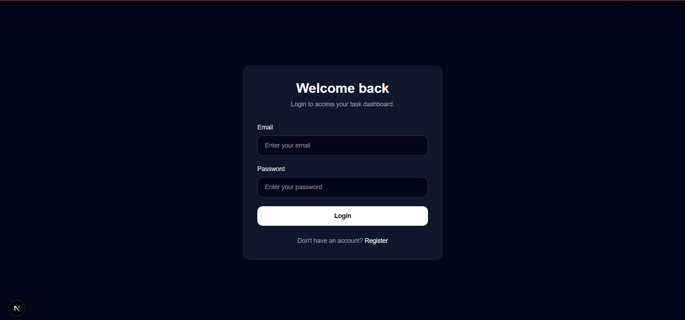
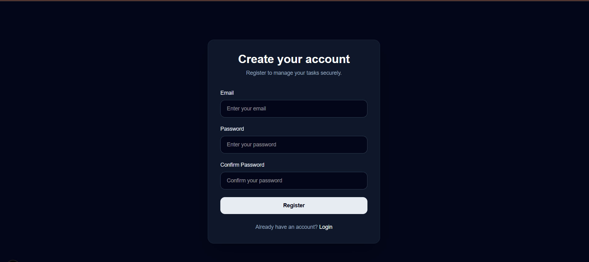
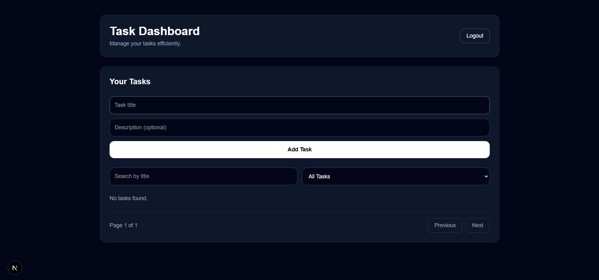
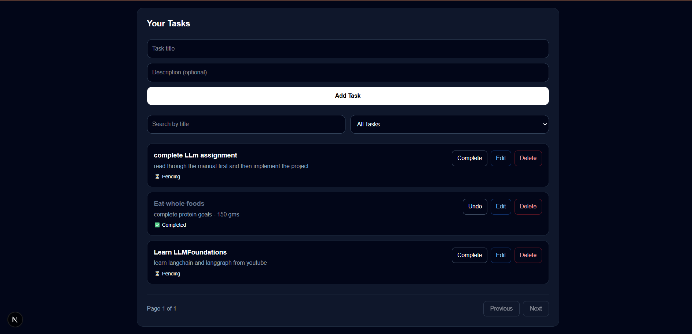
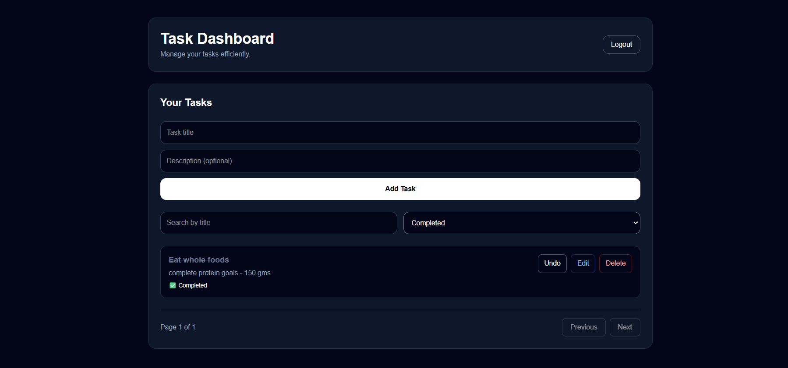
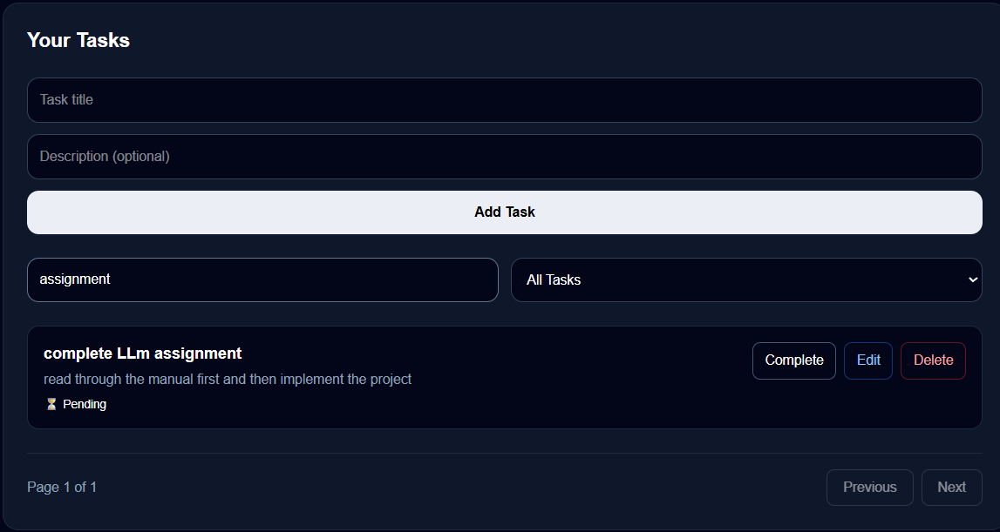

# 🚀 Task Manager Application

A modern full-stack task management application with authentication, scalable backend architecture, and intelligent features. Built with performance, usability, and real-world production practices in mind.

---

## 🎥 Demo

👉 **Watch the demo here below:**
[Click to view demo video]
<video controls src="assets/Rec.mp4" title="Title">Task Manager CRUD App</video>

---

## ✨ Features

* 🔐 Secure Authentication (JWT-based)
* 📝 Create, Update, Delete Tasks (CRUD)
* 📂 Organized Task Management
* ⚡ Real-time UI Updates
* 📱 Fully Responsive Design
* 🤖 AI-powered enhancements *(if implemented)*
* 🔄 Persistent state management (Zustand)

---

## 🛠️ Tech Stack

### Frontend

* Next.js
* TypeScript
* Tailwind CSS
* Shadcn UI

### Backend

* Node.js
* Express.js

### State Management

* Zustand

### Other Tools

* Axios
* JWT Authentication

---

## 🏗️ Architecture Overview

* Component-based scalable frontend
* RESTful backend APIs
* JWT-based authentication system
* Clean separation of concerns
* Optimized for performance and maintainability

---

## 📸 Screenshots

### 🔐 Authentication
#### Login

---
#### Register

### 🏠 Dashboard



---

### 📝 Task Management

#### CRUD functionality implementation:


#### Filter:


#### Search By Name:

---

## ⚙️ Installation & Setup

### 1. Clone the repository

```bash
git clone https://github.com/AnantaJaitley/TaskManager.git
```

### 2. Install dependencies

```bash
npm install
```

### 3. Run the development server

```bash
npm run dev
```

---

## 🔑 Environment Variables

Create a `.env` file and add:

```env
JWT_SECRET=your_secret_key
API_URL=your_backend_url
```

---

## 🚀 Future Improvements

* 🔔 Notifications system
* 📊 Analytics dashboard
* 🤝 Collaboration features
* ☁️ Deployment (AWS / Vercel)
* 🧠 Advanced AI integrations

---

## 📌 Project Highlights

* Production-ready architecture
* Clean and maintainable codebase
* Scalable design patterns
* Real-world full-stack implementation

---

## 👨‍💻 Author

Developed by **AnantaJaitley**

---

## ⭐ Show Your Support

If you like this project, consider giving it a ⭐ on GitHub!
